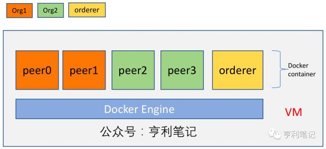
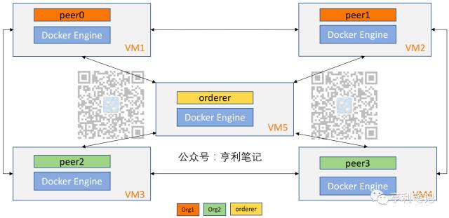

*发布者: 币学院 发表于: 2017-7-4 16:40 原作者: 张海宁、陈家豪来自: 亨利笔记*

#### 1. 概述
本文将介绍如何使用 Docker 容器技术来建立起一个多节点`Fabric`集群，并且描述在集群上如何进行基本的操作，如`chaincode`的生命周期维护等。文中采用Fabric 1.0的端到端（e2e_cli）示例作为基础来说明原理。本文提供是手动配置的方法，后续将介绍利用容器平台（如 K8s 等）自动部署超级账本的方式。

<!--more-->



Fabric 源码中包含一个简单的e2e单机部署示例，方便用户理解、研究和开发应用。如图1.1所示，在单个机器节点上通过 docker-compose 建立了5个节点的Fabric网络，每个节点都是由单独的 Docker 容器来模拟。其中 peer0 和 peer1 是同属于 org1 的节点，peer2 和 peer3 是同属于 org2 的节点，它们都加入了相同的 channel 中，并在该 channel 中进行交易，而 orderer 则为该 channel 中的交易提供排序服务。



虽然e2e_cli的示例比较简单，但它把多个节点混合部署在一起，无法区分哪些配置对应哪个节点。另外，在实际场景中，Fabric 节点可能会由不同的组织分别拥有和维护，peers 和 orderer 必然会分布在不同的物理节点上，因此多节点的Fabric 部署成为需要解决的问题

#### 2. 单机运行Hyperledger Fabric实例

需要安装Go，并下载Fabric源码
```shell
sudo apt-get install golang
mkdir gocode/src/github.com/hyperledger/
cd gocode/src/github.com/hyperledger/
git clone https://github.com/hyperledger/fabric.git
```
记得配置环境变量
```shell
vi ~/.profile
export GOPATH=$HOME/gocode
```
下载docker image，在`gocode/src/github.com/hyperledger/fabric`下执行
```shell
make docker
```
可能需要执行
```shell
git branch --all
git fetch
make clean
make dist-clean
make configtxgen
make docker
make peer-docker
make orderer-docker
make couchdb
```
PS: 如果`make docker`运行错误，重新输入`make docker`运行

<!-- 也可以用docker命令手动安装相关镜像，注意`fabric`相关镜像没有`latest`版本
```shell
docker pull hyperledger/fabric-orderer:x86_64-1.0.1
docker pull hyperledger/fabric-peer:x86_64-1.0.1
# rename it to 'latest'
docker tag hyperledger/fabric-orderer:x86_64-1.0.1 hyperledger/fabric-orderer:latest
docker tag hyperledger/fabric-peer:x86_64-1.0.1 hyperledger/fabric-peer:latest 
```
-->

也可以进入到`fabric/examples/e2e_cli`目录下，运行`./download-dockerimages.sh`来下载必要镜像。镜像下载完成后，就可以通过 `docker save` 命令把镜像打包成压缩文件，传送到各个VM。当VM接收到压缩文件后，可以通过 `docker load` 来解压和导入镜像。如果有私有的容器镜像仓库registry，如 Harbor 等，也可以把镜像推送到私有registry，再从各个机器中拉取。

通过以下命令来保存所有 `tag` 含有 `fabric` 标识的镜像到名字为 `images` 的压缩文件中：
```shell
docker save $(docker images | grep fabric | awk {‘print $1’} ) -o images
```
生成 `images` 文件后，就可以通过scp把它拷贝到还没有镜像的其他节点中，例如，地址为 10.112.122.6 的节点需要安装以上镜像，可以通过以下命令把`images` 远程拷贝到 10.112.122.6 的home目录下：
```shell
scp images root@10.112.122.6:~
```
然后在 10.112.112.6 这台主机的home目录上运行：
```shell
docker load -i images
```
等待一段时间后, 通过 `docker images` 命令就能查看到相关镜像的信息。

测试安装结果
```shell
cd examples/e2e_cli
./network_setup.sh up
```
进入到 `fabric/example/e2e_cli` 文件夹中，`network_setup.sh` 是一键测试脚本，该脚本启动了6个 docker 容器，其中有4个容器运行 peer 节点和1个容器运行 orderer 节点，它们组成一个Fabric集群。另外, 还有一个 cli 容器用于执行创建 channel 、加入 channel 、安装和执行chaincode 等操作。测试用的 chaincode 定义了两个变量，在实例化的时候给这两个变量赋予了初值，通过invoke操作可以使两个变量的值发生变化。

如果正常则显示如下内容，即在单机运行4+1的Fabric实例
```
=== All GOOD，End-2-End execution completed ===
```
许多的调试信息具体可参考 e2e_cli 目录下的 `script/script.sh` 文件。

可以关闭Fabric网络
```shell
./network_setup.sh down
```

#### 3. 把单节点e2e_cli范例改为多节点的大致步骤

1.    准备环境

运行Fabric节点需要依赖以下工具：

a. Docker：用于管理Fabric镜像以及运行 peer 和 orderer 等组件

b. Docker-compose：  用于配置 Fabric 容器

c. Fabric源码：源码提供了用于生成证书和配置 channel 的工具和测试代码

d. Go语言开发环境：源码的工具编译依赖于 Go 语言

2.    配置多节点Fabric集群

在单节点e2e_cli示例中，所有节点部署在同一个 docker-compose 的内部网络中，通过容器的7051端口进行通信。但是在多节点的情况下，容器之间不能进行直接通讯，因此需要把容器的7051端口映射到宿主机上，通过各个宿主机的7051端口来实现节点间通信。我们在每个节点中修改 docker-compose.yaml 中的 service 定义，在不同节点只启动需要的 service。例如，在节点1中只启动peer0 的 service，在节点5中仅启动 orderer 等。

3.    启动多节点Fabric集群

在各个节点上配置好 Fabric 的启动环境后，需要依次登录到节点上通过docker-compose up的方式启动 Fabric 节点。由于启动环境有依赖关系，如 peer1 以 peer0 作为发现节点，因此需要先启动 peer0 再启动 peer1 。

4.   配置channel

在 Fabric 中，channel 代表了一个私有的广播通道，保证了消息的隔离性和私密性，它由 orderer 来管理。channel 中的成员共享该 channel 的账本，并且只有通过验证的用户才能在 channel 中进行交易，与一个 channel 相关的属性记录在该channel的初始区块中，可通过 reconfiguration 交易进行更改。channel的初始区块由 create channel 交易生成，peer 向 orderer 发送该交易时会带有的 config.tx 文件，该文件定义 channel 的相关属性。

5.   发布chaincode

chaincode 是开发人员按照特定接口编写的智能合约，通过 SDK 或者 CLI 在 Fabric 的网络上安装并且初始化后，该应用就能访问网络中的共享账本。

chaincode 的生命周期如下:

a.    Install（安装）

chaincode 要在 Fabric 网络上运行，必须要先安装在网络中的 peer 上，安装同时注明版本号保证应用的版本控制。

b.    Instantiate（实例化）

在 peer 上安装 chaincode 后，还需要实例化才能真正激活该 chaincode 。在实例化的过程中，chaincode 就会被编译并打包成容器镜像，然后启动运行。若 chaincode 在实例化的过程中更新了数据状态，如给某个变量赋予初始值，则该状态变化会被记录在共享账本中。每个应用只能被实例化一次，实例化可在任意一个已安装该 chaincode 的 peer 上进行。

c.    Invoke和query （调用和查询）

chaincode 在实例化后，用户就能与它进行交互，其中 query 查询与应用相关的状态（即只读），而 invoke 则可能会改变其状态。

d.    Upgrade（升级）

在 chaincode 添加新功能或出现 bug 需要升级时，可以通过 upgrade 交易来实现。这时需要把新的代码通过install交易安装到正在运行该 chaincode的 peer 上，安装时需注明比先前版本更高的版本号，接下来只需要向任意一个安装了新代码的 peer 发送 upgrade 交易就能更新 chaincode ，chaincode 在更新前的状态也会得到保留。

#### 4. 部署Hyperledger Fabric v1.0多节点集群（文档一）

1. 准备工作

先在5台计算机（虚拟机）上按上面步骤布置好Hyperledger Fabric环境，并确认`ssh server`开启
```shell
ps -ef | grep sshd
```
如果没有安装server端，可以
```shell
sudo apt-get install openssh-server
```
虚拟机可以直接克隆生成五个新的虚拟机。其中4台虚拟机运行 peer 节点，另外一台运行 orderer 节点，为其他的四个节点提供order服务。

在`VirtualBox`中`控制>设置>网络`选择`Host-Only`模式

在控制台中输入
```shell
ifconfig
```
可以查看本机IP地址

将5台虚拟机分别作为`order` `peer0.org1` `peer1.org1` `peer0.org2` `peer1.org2`节点，并记住对应的IP地址，假设依次为
```
192.168.99.101
192.168.99.102
192.168.99.103
192.168.99.104
192.168.99.105
```
2. 生成公私钥、证书、创世区块

在任意VM上运行 `fabric/examples/e2e_cli` 目录下的 `generateArtifacts.sh` 脚本
```shell
cd examples/e2e.cli
./generateArtifacts.sh mychannel
```
可生成两个目录，它们分别为 `channel-artifacts/` 和 `crypto-config/`，两个目录的结构分别如下:
```
-channel-artifacts
    -channel.tx
    -genesis.block
    -Org1MSPanchors.tx
    -Org2MSPanchors.tx
```
上述目录里的文件用于 `orderer` 创建 `channel` , 它们根据 `configtx.yaml` 的配置生成。
```
-crypto-config
    -ordererOrganizations
    -peerOrganizations
```
上述目录里面有 `orderer` 和 `peer` 的证书、私钥和以及用于通信加密的`tls`证书等文件，它通过 `configtx.yaml` 配置文件生成。

该命令只需在某个VM上运行一次，其他VM上就不需要运行。

2. `order`节点设置

设置节点的`docker-compose`文件

e2e_cli中提供了多个yaml文件，我们可以基于docker-compose-cli.yaml文件创建：
```shell
cp docker-compose-cli.yaml docker-compose-peer.yaml
```
然后修改docker-compose-peer.yaml，去掉orderer的配置，只保留一个peer和cli，因为我们要多级部署，节点与节点之前又是通过主机名通讯，所以需要修改容器中的host文件，也就是extra_hosts设置，修改后的peer配置如下：
```yaml
peer0.org1.example.com:
    container_name: peer0.org1.example.com
    extends:
    file:  base/docker-compose-base.yaml
    service: peer0.org1.example.com
    extra_hosts:
    - "orderer.example.com:192.168.99.102"
```
同样，cli也需要能够和各个节点通讯，所以cli下面也需要添加extra_hosts设置，去掉无效的依赖，并且去掉`command`这一行，每个peer都会有个对应的客户端，也就是cli，所以只需要去手动执行一次命令，而不是自动运行。修改后的cli配置如下：
```yaml
cli:
    container_name: cli
    image: hyperledger/fabric-tools
    tty: true
    environment:
    - GOPATH=/opt/gopath
    - CORE_VM_ENDPOINT=unix:///host/var/run/docker.sock
    - CORE_LOGGING_LEVEL=DEBUG
    - CORE_PEER_ID=cli
    - CORE_PEER_ADDRESS=peer0.org1.example.com:7051
    - CORE_PEER_LOCALMSPID=Org1MSP
    - CORE_PEER_TLS_ENABLED=true
    - CORE_PEER_TLS_CERT_FILE=/opt/gopath/src/github.com/hyperledger/fabric/peer/crypto/peerOrganizations/org1.example.com/peers/peer0.org1.example.com/tls/server.crt
        - CORE_PEER_TLS_KEY_FILE=/opt/gopath/src/github.com/hyperledger/fabric/peer/crypto/peerOrganizations/org1.example.com/peers/peer0.org1.example.com/tls/server.key
    - CORE_PEER_TLS_ROOTCERT_FILE=/opt/gopath/src/github.com/hyperledger/fabric/peer/crypto/peerOrganizations/org1.example.com/peers/peer0.org1.example.com/tls/ca.crt
    - CORE_PEER_MSPCONFIGPATH=/opt/gopath/src/github.com/hyperledger/fabric/peer/crypto/peerOrganizations/org1.example.com/users/Admin@org1.example.com/msp
    working_dir: /opt/gopath/src/github.com/hyperledger/fabric/peer
    volumes:
        - /var/run/:/host/var/run/
        - ../chaincode/go/:/opt/gopath/src/github.com/hyperledger/fabric/examples/chaincode/go
        - ./crypto-config:/opt/gopath/src/github.com/hyperledger/fabric/peer/crypto/
        - ./scripts:/opt/gopath/src/github.com/hyperledger/fabric/peer/scripts/
        - ./channel-artifacts:/opt/gopath/src/github.com/hyperledger/fabric/peer/channel-artifacts
    depends_on:
    - peer0.org1.example.com
    extra_hosts:
    - "orderer.example.com:192.168.99.101"
    - "peer0.org1.example.com:192.168.99.102"
    - "peer1.org1.example.com:192.168.99.103"
    - "peer0.org2.example.com:192.168.99.104"
    - "peer1.org2.example.com:192.168.99.105"
```
在单机模式下，4个peer会映射主机不同的端口，但是我们在多机部署的时候是不需要映射不同端口的，所以需要修改`base/docker-compose-base.yaml`文件，将所有peer的端口映射都改为相同的：
```yaml
ports:
    - 7051:7051
    - 7052:7052
    - 7053:7053
```
设置orderer节点的docker-compose文件,与创建peer的配置文件类似，复制一个yaml文件出来进行修改：
```
cp docker-compose-cli.yaml docker-compose-orderer.yaml
```
`orderer`服务器上只需要保留order设置，其他peer和cli设置都可以删除。orderer可以不设置extra_hosts

3. 分发配置文件

前面操作都是在`orderer`节点上完成的，接下来需要将这些文件分发到另外4台服务器上

先登录`peer0.org1`节点，将本地的e2e_cli文件夹删除：
```shell
rm e2e_cli –R
```
然后再登录到`orderer`服务器上，退回到`examples`文件夹
```shell
scp -r e2e_cli UserName@192.168.99.102:/gocode/src/github.com/hyperledger/fabric/examples/
```
我们在前面配置的就是`peer0.org1`上的节点，所以复制过来后不需要做任何修改。

再次运行scp命令，复制到`peer1.org1`上，然后我们需要对docker-compose-peer.yaml做一个小小的修改，将启动的容器改为peer1.org1.example.com，并且添加peer0.org1.example.com的IP映射，对应的cli中也改成对peer1.org1.example.com的依赖(各种文件索引位置都要修改)。这是修改后的peer1.org1.example.com上的配置文件：
复制代码
```yaml
version: '2'

services:

    peer1.org1.example.com:
    container_name: peer1.org1.example.com
    extends:
        file:  base/docker-compose-base.yaml
        service: peer1.org1.example.com
    extra_hosts:
        - "orderer.example.com:192.168.99.101"
        - "peer0.org1.example.com:192.168.99.102"

    cli:
    container_name: cli
    image: hyperledger/fabric-tools
    tty: true
    environment:
        - GOPATH=/opt/gopath
        - CORE_VM_ENDPOINT=unix:///host/var/run/docker.sock
        - CORE_LOGGING_LEVEL=DEBUG
        - CORE_PEER_ID=cli
        - CORE_PEER_ADDRESS=peer1.org1.example.com:7051
        - CORE_PEER_LOCALMSPID=Org1MSP
        - CORE_PEER_TLS_ENABLED=true
        - CORE_PEER_TLS_CERT_FILE=/opt/gopath/src/github.com/hyperledger/fabric/peer/crypto/peerOrganizations/org1.example.com/peers/peer1.org1.example.com/tls/server.crt
        - CORE_PEER_TLS_KEY_FILE=/opt/gopath/src/github.com/hyperledger/fabric/peer/crypto/peerOrganizations/org1.example.com/peers/peer1.org1.example.com/tls/server.key
        - CORE_PEER_TLS_ROOTCERT_FILE=/opt/gopath/src/github.com/hyperledger/fabric/peer/crypto/peerOrganizations/org1.example.com/peers/peer1.org1.example.com/tls/ca.crt
        - CORE_PEER_MSPCONFIGPATH=/opt/gopath/src/github.com/hyperledger/fabric/peer/crypto/peerOrganizations/org1.example.com/users/Admin@org1.example.com/msp
    working_dir: /opt/gopath/src/github.com/hyperledger/fabric/peer
    volumes:
        - /var/run/:/host/var/run/
        - ../chaincode/go/:/opt/gopath/src/github.com/hyperledger/fabric/examples/chaincode/go
            - ./crypto-config:/opt/gopath/src/github.com/hyperledger/fabric/peer/crypto/
        - ./scripts:/opt/gopath/src/github.com/hyperledger/fabric/peer/scripts/
        - ./channel-artifacts:/opt/gopath/src/github.com/hyperledger/fabric/peer/channel-artifacts
    depends_on:
        - peer1.org1.example.com
    extra_hosts:
    - "orderer.example.com:192.168.99.101"
    - "peer0.org1.example.com:192.168.99.102"
    - "peer1.org1.example.com:192.168.99.103"
    - "peer0.org2.example.com:192.168.99.104"
    - "peer1.org2.example.com:192.168.99.105"
```
接下来继续使用`scp`命令将orderer上的文件夹传送给`peer0.org2`和`peer1.org2`，然后也是修改一下docker-compose-peer.yaml文件，使得其启动对应的`peer`节点。

4. 启动`Fabric`

现在所有文件都已经准备完毕，可以启动我们的Fabric网络了。

首先启动`orderer`节点，在`orderer`服务器上运行：
```shell
docker-compose -f docker-compose-orderer.yaml up –d
```
运行完毕后我们可以使用`docker ps`看到运行了一个名字为`orderer.example.com`的节点。

然后启动`peer`节点，切换到`peer0.org1.example.com`服务器，启动本服务器的peer节点和cli：
```shell
docker-compose -f docker-compose-peer.yaml up –d
```
运行完毕后使用docker ps应该可以看到2个正在运行的容器。

接下来依次在另外3台服务器运行启动peer节点容器的命令：
```shell
docker-compose -f docker-compose-peer.yaml up –d
```
现在整个`Fabric` 4+1服务器网络已经成型，接下来是创建`channel`和运行`ChainCode`。

切换到`peer0.org1.example.com`服务器上，使用该服务器上的cli来运行创建`Channel`和运行`ChainCode`的操作

首先进入cli容器：
```shell
docker exec -it cli bash
```
进入容器后,可以看到命令提示变为：
```shell
root@b41e67d40583:/opt/gopath/src/github.com/hyperledger/fabric/peer#
```
说明已经以root的身份进入到cli容器内部。官方已经提供了完整的创建`Channel`和测试`ChainCode`的脚本，并且已经映射到cli容器内部，所以只需要在cli内运行如下命令：
```shell
./scripts/script.sh mychannel
```
那么该脚本就可以一步一步的完成创建通道，将其他节点加入通道，更新锚节点，创建`ChainCode`，初始化账户，查询，转账，再次查询等链上代码的各个操作都可以自动化实现。直到最后，系统提示：
```
===================== All GOOD, End-2-End execution completed =====================
```
说明4+1的`Fabric`多机部署成功了。我们现在是在`peer0.org1.example.com`的cli容器内，我们也可以切换到`peer0.org2.example.com`服务器，运行`docker ps`命令，可以看到本来是2个容器的，现在已经变成了3个容器

#### 5. 部署Hyperledger Fabric v1.0多节点集群（文档二）

此文档和上一节的方法基本相同，细节之处可做参考选择，方便理解。

以下各VM的工作目录为：
```shell
$GOPATH/src/github.com/hyperledger/fabric/examples/e2e_cli
```
可在任意VM上运行以下命令，生成构建 Fabric 网络所需的成员证书等必要材料：
```shell
bash generateArtifacts.sh
```
该命令只需在某个VM上运行一次，其他VM上就不需要运行。

在运行该命令的VM中会生成 `channel-artifacts` 和 `crypto-config` 目录，需要把它们拷贝到其他VM的 e2e_cli 目录下，如果在VM中已经存在该目录，则先把目录删除。当每个VM中都有统一的 `channel-artifacts` 和 `crypto-config` 目录后接下来就开始配置 compose 文件。

I. VM1的配置：

1.  修改 `/etc/hosts` 的映射关系

因为容器内部通过域名的方式访问 orderer , 因此需要通过修改 /etc/hosts 把orderer 的域名和 ip 地址对应起来，在文件中添加:
```yaml
10.112.122.69   orderer.example.com
```
2.  修改`docker-compose-cli.yaml`

在默认的情况下，`docker-compose-cli.yaml`会启动6个service（容器），它们分别为 `peer0.org1.example.com`、 `peer1.org1.example.com`、 `peer0.org2.example.com`、 `peer1.org2.example.com`、 `orderer.example.com` 和 `cli`，因为每台机器只运行与之对应的一个节点，因此需要注释掉无需启动的 service。

(1) 除 peer0.org1.example.com 和 cli service 外，其他 service 全部注释。

(2) 在 cli 的 volumes 中加入映射关系：
```yaml
-./peer/:/opt/gopath/src/github.com/hyperledger/fabric/peer/
-/etc/hosts:/etc/hosts
```
(3) 注释 cli 中的 depends_on 和 command :
```yaml
depends_on:
  #- orderer.example.com
  - peer0.org1.example.com
  #- peer1.org1.example.com
  #- peer0.org2.example.com
  #- peer1.org2.example.com

#command: /bin/bash -c './scripts/script.sh ${CHANNEL_NAME}; sleep $TIMEOUT'
```
之前我们把容器中的工作目录挂载到宿主机的 `e2e_cli/peer` 目录下, 是因为在执行 create channel 的过程中，orderer 会返回一个 mychannel.block 作为 peer 加入 channel 的依据，其他的 peer 要加入到相同的 channel 中必须先获取该 mychannel.block 文件。因此，通过挂载目录从宿主机就能方便获得 mychannel.block ，并且把它传输到其他的 VM 上。

挂载 `/etc/hosts` 的目的是把主机中 orderer.exmaple.com 与 IP 地址10.112.122.69 的映射关系带入容器中,目的是让 cli 能通过域名访问 orderer  。在实际环境中，建议通过配置 DNS 而不是修改 `/etc/hosts` 文件（下同）。

3.  修改 `base/peer-base.yaml`，添加 volumes：
```yaml
volumes:
-/etc/hosts:/etc/hosts
```
这样 peer 容器能通过域名访问orderer了。

II. VM2配置：

1. 修改 /etc/hosts 的映射关系

peer1.org1.example.com 使用了 peer0.org1.example.com 作为它的初始化节点，因此需要在主机中还需要加入 VM1 的 ip 地址。
```yaml
10.112.122.69   orderer.example.com
10.112.122.144  peer0.org1.example.com
```
2. 修改docker-compose-cli.yaml

(1) 类似VM1，除 peer1.org1.example.com 和 cli service 外，其他 service 全部注释。

(2) 在 cli 的 volumes 中加入映射关系：
```yaml
-./peer/:/opt/gopath/src/github.com/hyperledger/fabric/peer/
-/etc/hosts:/etc/hosts
```
(3) 注释cli中的 depends_on 和 command:
```yaml
depends_on:
 #- orderer.example.com
 #- peer0.org1.example.com
 - peer1.org1.example.com
 #- peer0.org2.example.com
 #- peer1.org2.example.com

#command:/bin/bash -c './scripts/script.sh ${CHANNEL_NAME}; sleep $TIMEOUT'
```
(4) 修改cli中的环境变量
```yaml
CORE_PEER_ADDRESS=peer1.org1.example.com:7051
```
3. 修改base/peer-base.yaml，同VM1的修改。


III. VM3配置：

1. 修改 /etc/hosts 的映射关系
```yaml
10.112.122.69      orderer.example.com
```
2. 修改docker-compose-cli.yaml

(1) VM3 上运行 peer2 节点，因此除 peer0.org2.example.com 和 cli service 外,其他 service 全部注释。

(2) 在cli的 volumes 中加入映射关系：
```yaml
-./peer/:/opt/gopath/src/github.com/hyperledger/fabric/peer/
-/etc/hosts:/etc/hosts
```
(3) 注释cli中的 depends_on 和 command :
```yaml
depends_on:
 #- orderer.example.com
 #- peer0.org1.example.com
 #- peer1.org1.example.com
 - peer0.org2.example.com
 #- peer1.org2.example.com

#command:/bin/bash -c './scripts/script.sh ${CHANNEL_NAME}; sleep $TIMEOUT'
```
(4) 修改cli中的环境变量
```yaml
CORE_PEER_LOCALMSPID="Org2MSP"
CORE_PEER_ADDRESS=peer0.org2.example.com:7051
CORE_PEER_TLS_ROOTCERT_FILE=/opt/gopath/src/github.com/hyperledger/fabric/peer/crypto/peerOrganizations/org2.example.com/peers/peer0.org2.example.com/tls/ca.crt
CORE_PEER_MSPCONFIGPATH=/opt/gopath/src/github.com/hyperledger/fabric/peer/crypto/peerOrganizations/org2.example.com/users/Admin@org2.example.com/msp
```
3. 修改base/peer-base.yaml，同VM1。

IV. VM4配置：

1. 修改/etc/hosts的映射关系

peer1.org2.example.com 使用了 peer0.org2.example.com 作为它的初始化节点，因此需要在映射关系中加入 VM3 的 ip 地址
```yaml
10.112.122.69       orderer.example.com
10.112.122.12       peer0.org2.example.com
```
2. 修改docker-compose-cli.yaml

(1) VM4运行peer3，因此除peer1.org2.example.com和cliservice 外,其他service全部注释

(2) 在cli的volumes中加入映射关系：
```yaml
-./peer/:/opt/gopath/src/github.com/hyperledger/fabric/peer/
-/etc/hosts:/etc/hosts
```
(3) 修改cli中的 depends_on 和 command:
```yaml
depends_on:
  - peer1.org2.example.com
#command:/bin/bash -c './scripts/script.sh ${CHANNEL_NAME}; sleep $TIMEOUT'
```
(4) 修改cli中的环境变量
```yaml
CORE_PEER_LOCALMSPID="Org2MSP"
CORE_PEER_ADDRESS=peer1.org2.example.com:7051
CORE_PEER_TLS_ROOTCERT_FILE=/opt/gopath/src/github.com/hyperledger/fabric/peer/crypto/peerOrganizations/org2.example.com/peers/peer0.org2.example.com/tls/ca.crt
CORE_PEER_MSPCONFIGPATH=/opt/gopath/src/github.com/hyperledger/fabric/peer/crypto/peerOrganizations/org2.example.com/users/Admin@org2.example.com/msp
```
3. 修改base/peer-base.yaml，同VM1。

V. VM5配置如下：

1. 修改docker-compose-cli.yaml

除orderer外的其他 service 全部注释，即只启动 orderer 。

VI. 启动多节点Fabric集群

1. 启动orderer

进入到 VM5 的 `fabric/examples/e2e_cli` 目录下，运行
```shell
docker-compose -f docker-compose-cli.yaml up -d
```
此时终端会出现大量记录，当出现`Beginning to service requests`时，orderer启动完成。有了 `orderer` 之后，就可以通过它来管理 `channel` 。

2. 启动 org1的第一个节点 peer0 ，即 peer0.org1.example.com

进入到 VM1 的 `fabric/examples/e2e_cli` 目录下，运行
```shell
docker-compose -f docker-compose-cli.yaml up -d
```
此时通过docker ps -a 命令可以看到成功启动了 peer0.org1.example.com 和 cli 两个容器。

接下来实现创建 channel 、加入 channel 和安装 chanicode 。首先进入到cli容器内：
```shell
docker exec -it cli bash
```
cli 与 orderer 之间的通讯使用 tls 加密，设置环境变量 ORDERER_CA 以作建立握手的凭证：
```yaml
$ORDERER_CA=/opt/gopath/src/github.com/hyperledger/fabric/peer/crypto/ordererOrganizations/example.com/orderers/orderer.example.com/msp/cacerts/ca.example.com-cert.pem
```
注：以下所有涉及到 ORDERER_CA 环境变量的命令都需预先给该变量赋值。

进入到 cli 容器后会自动跳转到 /opt/gopath/src/github.com/hyperledger/fabric/peer 目录，即工作目录，通过compose文件的配置，该目录映射为宿主机的 /e2e_cli/peer 。

在工作目录下输入以下命令，创建名为 mychannel 的 channel ：
```shell
peer channel create -o orderer.example.com:7050 -c mychannel -f ./channel-artifacts/channel.tx --tls --cafile $ORDERER_CA
```
`channel` 创建成功后，会在当前目录下生成`mychannel.block`文件。每个peer 在向 orderer 发送 `join channel` 交易的时候，需要提供这个文件才能加入到 `mychannel` 中，因此运行在其他 VM 上的 peer 需要得到 `mychannel.block` 文件来加入到 `mychannel` 中。由于之前的文件映射关系， `mychannel.block` 文件可在宿主机的 `e2e_cli/peer` 目录下获取，这时可以通过宿主机把 `mychannel.block` 拷贝到 VM2, VM3, VM4的 `e2e_cli/peer` 目录下。

把 peer0.org1.example.com 加入到 mychannel 中：
```shell
peer channel join -b mychannel.block
```
更新 mychannel 中 org1 的 anchor peer 的信息：
```shell
peer channel update -o orderer.example.com:7050 -c mychannel -f ./channel-artifacts/Org1MSPanchors.tx --tls --cafile $ORDERER_CA
```
安装 chaincode 示例 chaincode_example02 到 peer0.org1.example.com 中：
```shell
peer chaincode install -nmycc -v 1.0 -p \
github.com/hyperledger/fabric/examples/chaincode/go/chaincode_example02
```
这时候 chaincode 代码已经安装到了 peer0 节点上，但并未实例化运行。接下来先配置好其他节点。

3. 启动 org1 的第二个节点 peer1，即 peer1.org1.example.com

进入到VM2的 `fabric/examples/e2e_cli` 目录下，运行
```shell
docker-compose -f docker-compose-cli.yaml up -d
```
进入到 cli 容器内部：
```shell
docker exec -it cli bash
```
由于前面已经把 mychannel.block 拷贝到了 VM2 的 e2e_cli/peer 目录下，因此 mychannel.block 可通过容器内的 `/opt/gopath/src/github.com/hyperledger/fabric/peer` 目录访问。

把 peer1.org1.example.com 加入到 mychannel 中：
```shell
peer channel join -b mychannel.block
```
安装 chaincode_example02 到 peer1.org1.example.com 中：
```shell
peer chaincode install -nmycc -v 1.0 –p \
github.com/hyperledger/fabric/examples/chaincode/go/chaincode_example02
```
4. 启动 org2 的第一个节点 peer2，即 peer0.org2.example.com

进入到 VM3 的 `fabric/examples/e2e_cli` 目录下，运行
```shell
docker-compose-f docker-compose-cli.yaml up -d
```
进入到cli容器内部：
```shell
docker exec -it cli bash
```
把peer0.org2.example.com加入到mychannel中：
```shell
peer channel join -b mychannel.block
```
更新 mychannel 中 org2 的 anchor peer 的信息：
```shell
peer channel update -o orderer.example.com:7050 -c mychannel -f ./channel-artifacts/Org2MSPanchors.tx --tls --cafile $ORDERER_CA
```
安装 chaincode_example02 到 peer0.org2.example.com 中：
```shell
peer chaincode install -nmycc -v 1.0 -p \
github.com/hyperledger/fabric/examples/chaincode/go/chaincode_example02
```
5. 启动org2的第二个节点peer3 ，即 peer1.org2.example.com

进入到 VM4 的 `fabric/examples/e2e_cli` 目录下，运行
```shell
docker-compose-f docker-compose-cli.yaml up -d
```
首先进入到cli容器内部：
```shell
docker exec -it cli bash
```
把 peer1.org2.example.com 加入到 mychannel 中：
```shell
peer channel join -b mychannel.block
```
安装 chaincode_example02 到 peer1.org2.example.com 中：
```shell
peer chaincode install -nmycc -v 1.0 -p \
github.com/hyperledger/fabric/examples/chaincode/go/chaincode_example02
```
6. 运行chaincode

通过前面的步骤，整个多节点Fabric网络已经运行起来了，每个peer都加入到了标识为 `mychannel` 的 channel 中，并且都安装了一个简单的 chaincode (该 chaincode 在安装时被标识为 `mycc` ) 。下面步骤运行和维护 chaincode。

(1) 实例化chaincode

chaincode 的实例化可在任意 peer 上进行，并且 **chaincode 只能被实例化一次**，下面以在 peer0.org2.example.com 上实例化 chaincode 为例。

首先登录VM3并进入到cli容器内部运行：
```shell
peer chaincode instantiate -o orderer.example.com:7050 --tls --cafile $ORDERER_CA -C mychannel-nmycc -v 1.0 -c '{"Args":["init","a","100","b","200"]}' -P "OR     ('Org1MSP.member','Org2MSP.member')"
```
这时候会构建一个新的容器来运行chaincode，通过`docker ps -a` 命令可以看到新容器：
```
dev-peer0.org2.example.com-mycc-1.0
```
上述实例化中，我们对两个变量‘a’和‘b’分别赋予初值100和200，通过 channel 它们的值被同步到了其他peer的账本上，即使其他peer还没有构建运行 chaincode 的容器。

(2) 执行 chaincode 的 query 交易

由于 chaincode 已经被 peer0.org2.example.com 实例化了，因此其他 peer 不需要再次实例化它了，但是 chaincode 的状态（world state）却是已经记录在各个peer的账本上的。

 接下来我们在peer0.org1.example.com上查看chaincode的状态，登录到VM1上并进入cli容器内部执行：
```shell
peer chaincode query -C mychannel -nmycc -c '{"Args":["query","a"]}'
```
上面的命令查看 mycc 中变量 a 的值，由于在 peer 跟 chaincode 发生互动之前还不存在运行 chaincode 的容器，因此第一次交互的时候需要先构建运行 chaincode 的容器，等待一段时间后返回结果：100 。

此时通过 `docker ps -a` 命令能看到新容器：
```
dev-peer0.org1.example.com-mycc-1.0
```
该值与实例化时的赋值一致，说明 peer0.org1 和 peer0.org2 两个 peer 可以相互通信。

(3) 执行chaincode的invoke交易

接下来，我们执行一个 invoke 交易，使得变量 a 向变量 b 转帐 20，得到最终值为["a":"80","b":"220"]。

登录到VM2并进入到cli容器中中通过以下命令查询mycc的状态：
```shell
peer chaincode query -C mychannel -n mycc -c '{"Args":["query","a"]}'
```
稍作等待后返回结果为100，下面执行 invoke 交易，改变 a 的值为 80 ：
```shell
peer chaincode invoke -oorderer.example.com:7050  --tls --cafile $ORDERER_CA -C mychannel -n mycc -c '{"Args":["invoke","a","b","20"]}'
```
(4) 再次执行 chaincode 的 query 交易

在peer1.org1.example.com 上重复以上查看 chaincode 的步骤，得到返回结果为 80 ，说明测试通过，至此，Fabric网络构建完毕，各个部件工作正常。

7.  更新chaincode

通过 `channel upgrade` 命令可以使得 `chaincode` 更新到最新的版本，而低版本 chaincode 将不能再使用。

登录到VM1的 cli 容器中再次安装 chaincode_example02 ，但赋予它更高的版本号 2.0：
```shell
peer chaincode install -n mycc -v 2.0 -p \
github.com/hyperledger/fabric/examples/chaincode/go/chaincode_example02
```
在 VM1 的 cli 容器升级 chaincode ,添加两个变量 ‘c’和‘d’:
```shell
peer chaincode upgrade -o  orderer.example.com:7050 --tls --cafile $ORDERER_CA -n mycc -v 2.0 -c '{"Args":["init","c", "10","d","20"]}'
```
等待一段时间后，可以通过`docker ps -a` 来查看新容器构建的容器,该容器的名称为：
```
dev-peer0.org1.example.com-mycc-2.0
```
通过以下命令查询c的变量：
```shell
peer chaincode -n mycc -C mychannel -v 2.0 -c '{"Args":["query","c"]}'
```
返回结果为10

再次查询a的变量：
```shell
peer chaincode -n mycc -C mychannel -v 2.0 -c'{"Args":["query","a"]}'
```
返回结果为80，说明更新 chaincode 成功。

这时候对账本的修改会通过 orderer 同步到其他 peer 上，但是在其他 peer 上将无法查看或更改 chaincode 的状态，因为它们还在使用旧版的 chaincode ，所以其他 peer 要想正常访问还需再次安装 chaincode ，并且设置相同的版本号 ( chaincode 代码没发生改变，只是安装时版本号更新为 2.0 )，命令如下：
```shell
peerchaincode install -n mycc -v 2.0 –p \
github.com/hyperledger/fabric/examples/chaincode/go/chaincode_example02
```