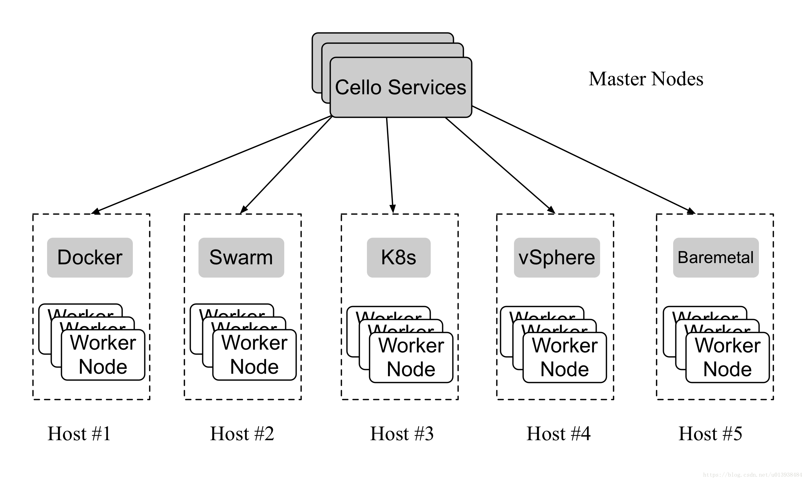

Cello 遵循典型的"主-从"工作体系结构。群集中有两种类型的节点。
- Master Node：Cello服务通过Worker Nodes提供的API接口管理（create/delete等）在Worker Nodes上的链，Master Node 提供web 面板(port 8080) and RESTful APIs (port 80).
- Worker Node： Cello支持从单个服务器到集群的多种类型的工作节点。以Docker主机或Swarm集群为例，Worker Nodes提供的API接口应该可以从主节点访问（通常在端口2375） 

<!--more-->



## Master Node 安装

Master Node包括如下服务:
- operator dashboard: 为操作者提供Web UI.
- engine: 为chain consumers提供RESTful APIs.
- watchdog: Watch for health checking.

系统要求
- Hardware: 8c16g100g
- Docker engine: 1.10.0~1.13.0 (Docker 17.0+ support is experimental)
- docker-compose: 1.8.0~1.12.0

两步安装

1. 拉取源码
```shell
git clone http://gerrit.hyperledger.org/r/cello && cd cello
```

2. 首次运行时，设置主节点，可以多次运行，结束后log out然后log in
```shell
make setup-master
```

## Mater Node 使用
启动全部服务
```shell
make start
```

碰到了`unauthorized`的错误，必须手动`sudo` pull镜像
```shell
sudo docker pull hyperledger/cello-user-dashboard
```

停止全部服务
```
make stop 
```
重启全部服务
```
make restart
```
单独重启特定服务，比如dashboard
```
make redeploy service=dashboard
```
查看全部日志
```
make logs
```
查看特定服务的日志，
```
make log service=watchdog
```
可以打开`MASTER_NODE_IP:8080`看到网页版的`operation dashboard`