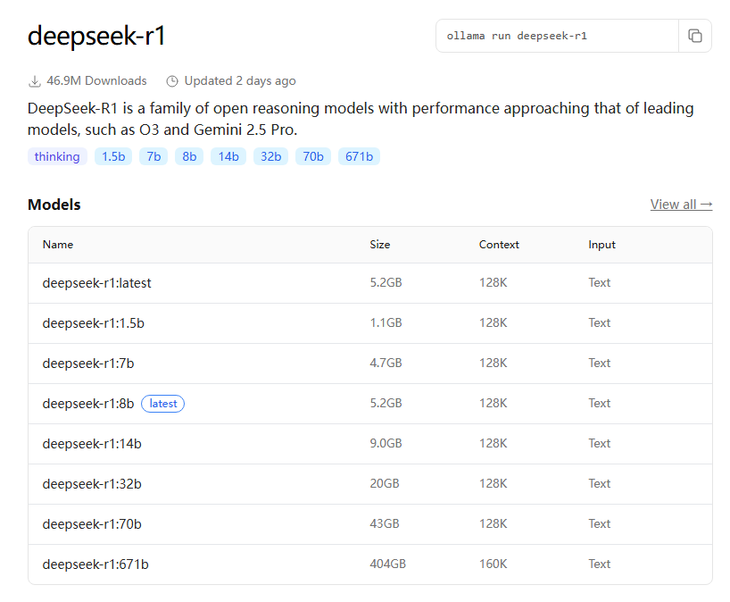

`Ollama`是专为本地机器便捷部署和运行大模型而设计的。

## 1.部署`Ollama`

官网：[https://ollama.com](https://ollama.com)

`Ollama`支持macOS、Linux、Windows等系统直接裸机部署，也支持Docker部署。

Linux服务器可以通过以下命令行一键下载和安装：

```shell
curl -fsSL https://ollama.com/install.sh | sh
```

<!--more-->

如果没有报错，会提示`Ollama`的默认配置文件地址：

```shell
Created symlink /etc/systemd/system/default.target.wants/ollama.service → /etc/systemd/system/ollama.service.
```

使用以下命令查看`Ollama`服务状态，如果显示`running`就说明没有问题：

```shell
sudo systemctl status ollama
```

查看安装版本号：

```shell
ollama -v
```

查看帮助：

```shell
ollama -h
```

另外也可以使用Docker一键部署：

```shell
docker run -d -v ollama:/root/.ollama -p 11434:11434 --name ollama --restart always ollama/ollama
```

## 2. 网络配置

`Ollama`安装后，默认只能本地访问。

如果需要局域网内其他机器也能访问，需要对`OLLAMA_HOST`进行配置，开启监听任何来源IP。

首先，需要编辑配置文件：

```shell
sudo vim /etc/systemd/system/ollama.service
```
在`[Service]`下面修改，加上：

```text
Environment="OLLAMA_HOST=0.0.0.0:11434"
```

修改配置后，需要重启`Ollama`：

```shell
systemctl daemon-reload
systemctl restart ollama
```

安装成功后，可以在**客户端**的浏览器打开 http://your_ip:11434/，如果出现`Ollama is running`，说明服务已经成功运行。

如果提示访问不可用，应该是服务器防火墙限制了。

这时候，通过iptables，可以限制和允许特定IP地址对特定端口的访问。

如果要只允许特定IP地址对特定端口的访问，可以使用iptables的INPUT链和ACCEPT动作：

```shell
iptables -A INPUT -p tcp --dport <端口号> -s <IP地址> -j ACCEPT
```

对于`Ollama`来说，端口号即`11434`。

然后，为了安全性，推荐添加另一条规则来阻止除特定IP地址以外的所有其他IP访问该端口：

```shell
iptables -A INPUT -p tcp --dport <端口号> -j DROP
```

## 3. 部署基础模型，如DeepSeek-R1

访问：[https://ollama.com/search](https://ollama.com/search)

可以看到`Ollama`支持部署的模型列表，默认按热度排序。

这里选择deepseek-r1，可以看到deepseek-r1的介绍和各种不同大小的版本（2025年6月4日截图）：



根据安装服务器的规格，选择一个合适的模型，例如deepseek-r1:8b。

选择后，复制右上角的命令行，在服务器上运行，即可本地部署：

```shell
ollama run deepseek-r1
```

等待安装完成，会出现命令行对话框，即可以开始使用了。

## 4. 安装对话软件

可以在客户端安装对话软件，配置本地模型后，即可使用，例如：

- [Chatbox](https://chatboxai.app)
- [Open WebUI](https://www.openwebui.com)

对于cursor等可以配置本地模型的软件，选择`Ollama`模型即可。
