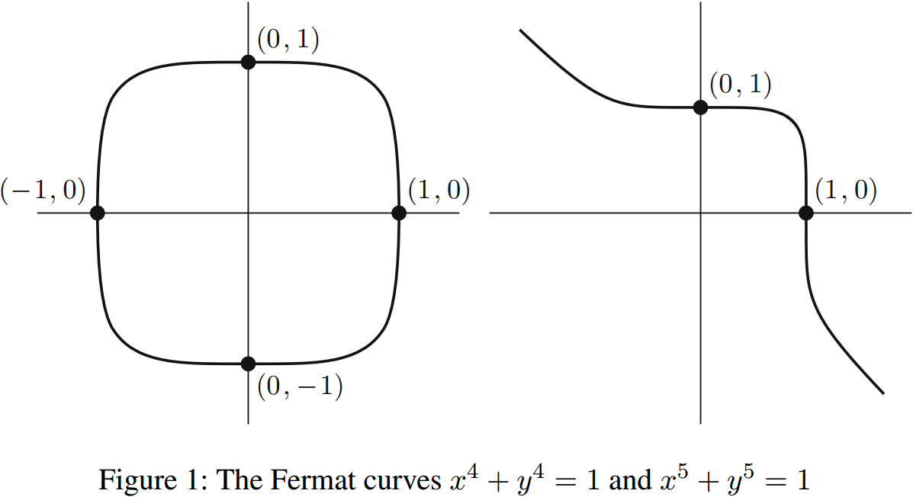
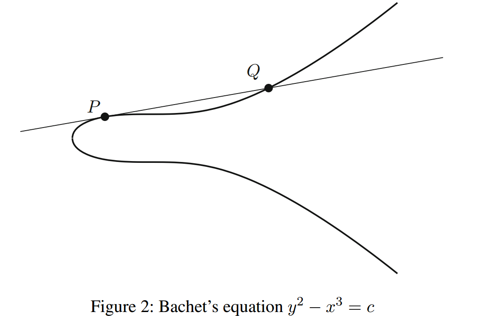
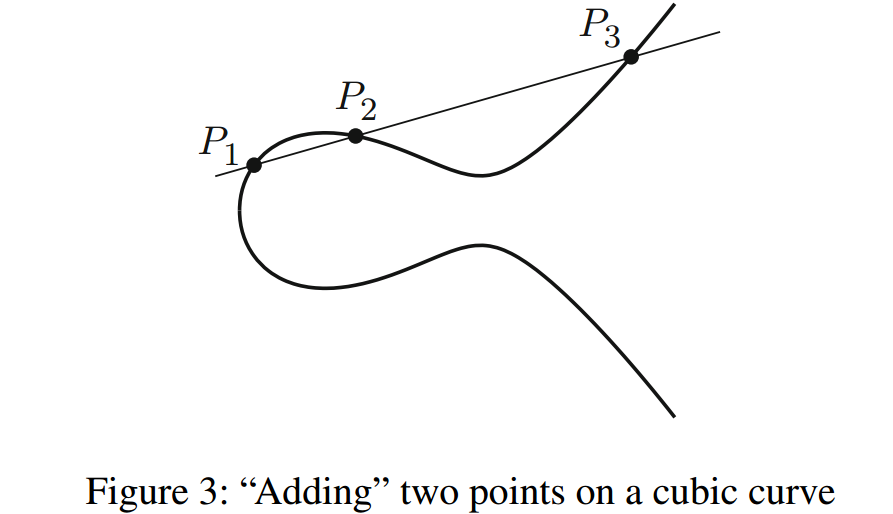

## 《椭圆曲线上的有理点》（对Introduction的翻译）

丢番图方程（Diophantine equations）的理论是数论（number theory ）的一个分支，主要研究多项式方程的整数解或有理数解。这个学科本身是以古希腊最伟大的代数学家之一，亚历山大的丢番图命名的，因为他提出并解决了许多这方面的问题。

大多数读者应该都熟悉费马大定理。这个定理是费马在17世纪提出的，即如果$n \geq 3$是一个整数，那么方程：
$$X^n + Y^n = Z^n$$
没有非零的整数解$X,Y,Z$。相应地，这断言了方程：
$$x^n + y^n = 1$$
在有理数上有解的唯一情况是$x=0$或$y=0$。

作为丢番图方程的另一个例子，我们考虑将一个整数写成平方数与立方数之差的问题。换句话说，我们固定一个整数$c \in \mathbb{Z}$，然后寻找丢番图方程：
$$y^2 - x^3 = c$$
在有理数上的解$x,y \in \mathbb{Q}$。在1621年，由Bachet发现了一个重要性质，即这个方程存在一个复制公式：如果$(x,y)$是方程的有理数解，且$y\neq 0$，那么不难验证：
$$(\frac{x^4-8cx}{4y^2}, \frac{-x^6-20cx^3+8c^2}{8y^3})$$
也是此方程的有理数解。此外，可以证明（尽管Bachet没有做到），如果$c \notin \lbrace 1,-432 \rbrace$且原始解满足$xy\neq 0$，那么这个过程可以不断地重复，从而产生无穷多的不同解。所以除了$1$和$-432$，如果一个整数可以用非零有理数表示成一个平方数与一个立方数之差，那么它可以有无限多种表示方式。例如，如果我们把解$(3,5)$代入方程：
$$y^2-x^3=-2$$
然后使用Bachet的复制公式，我们可以找到一系列的解：
$$(3,5),\quad (\frac{129}{10^2},-\frac{383}{10^3}),\quad (\frac{2340922881}{7660^2},-\frac{113259286337279}{7660^3}),\dots$$
如你所见，分子和分母很快就变得非常大。

接下来，我们对同一个方程：
$$y^2 - x^3 = c$$
讨论在整数情况下的解$x,y \in \mathbb{Z}$。在17世纪50年代，费马向英国数学界提出了一个挑战问题：证明方程$y^2−x^3 = −2$只有两个整数解，即$(3,\plusmn 5)$。这与有理数解的问题形成了鲜明的对比，因为我们已经知道存在无限多的有理数解。与费马同时代的人似乎都没有解决这个问题，而欧拉在18世纪30年代给出了一个不完整的证明，正确的证明直到150年后才被给出！然后在1908年，Axel Thue取得了一个巨大的突破：证明了对于任何非零整数$ c $，方程$y^2 - x^3 = c$在整数$x$和$y$上只有有限个解。这是对费马挑战问题（在性质上）巨大的一般化，因为它说明了在无限多个有理数的解中，只有有限多个可以是整数。

十七世纪见证了笛卡尔将坐标引入几何。这是一项革命性的发展，使得几何的问题可以用代数的方法来解决，同时代数的问题也可以用几何的方法去研究。例如，如果$n$是偶数，那么费马方程$x^n + y^n = 1$在$xy$平面上的实数解会形成一个几何形状，看起来像一个被压扁的圆。费马定理就等价于断言：在这个被压扁的圆上，唯一具有有理数坐标的点是$(\plusmn 1, 0)$和$(0, \plusmn 1)$这四个点。当指数为奇数时，费马方程的图像看起来有点不同。指数为$4$和$5$的费马曲线，如图$1$所示。

类似地，我们可以看看Bachet方程$y^2 - x^3 = c$，并且绘制在图$2$中。回想一下，Bachet发现了一个复制公式，在给定一个有理数解时，可以用来产生一个新的有理数解。Bachet公式相当复杂，人们可能想知道它从何而来。答案是，来自几何学！如图2所示，假设$P = (x, y)$是我们的原始解，即$P$是曲线上的一个点。接下来，我们在点$P$处画出曲线的切线，这是微积分第一学期的一个简单练习。这条切线与曲线相交于另一个点，我们把这个点标记为$Q$。然后，如果用代数方法计算出$Q$的坐标，就可以得到Bachet复制公式。所以，在代数上看起来复杂的Bachet公式，有一个简单的几何解释，就是切线与曲线的交点。这可能是我们第一次接触到代数、数论和几何之间产生了丰富的相互作用。

在分类上，最简单的丢番图方程是一元多项式方程：
$$a_n x^n + a_{n-1}x^{n-1} + \dots + a_1 x + a_0 =0$$
假设其中$a_0,\dots,a_n$是整数，我们如何找到所有整数解和所有有理数解呢？高斯引理提供了一个简单的答案。如果用最约化形式$p/q$表示有理数解，那么高斯引理告诉我们，$q$整除$a_n$且$p$整除$a_0$。这给出了可能存在有理数解的一个小范围列表，我们可以把它们逐个代入方程来确定是不是真正的解。如此看来，一元丢番图方程是很简单的。

当我们转向二元丢番图方程时，情况发生了巨大的改变。假设我们取一个系数为整数的多项式$f(x, y)$，然后看方程：
$$f(x,y) = 0$$
例如，费马方程和Bachet方程都具有这样的形式。很自然地，以下是我们可能会问的一些问题:

- $(a)$ 是否存在整数解？
- $(b)$ 是否存在有理数解？
- $(c)$ 是否存在无穷多的整数解？
- $(d)$ 是否存在无穷多的有理数解？

在这样概括性的描述下，当前只有问题$(c)$得到了充分的回答，尽管最近在问题$(d)$上也取得了很大的进展。

方程$f(x, y) = 0$的实数解集在$xy$平面上形成一条曲线。这样的曲线被称为*代数曲线（algebraic curves）*，表示它们是多项式方程的解的集合。为了回答问题$(a) - (d)$，我们可以从简单的多项式开始尝试，比如一次多项式（也称线性多项式，因为它们的图形是直线）。对于一个整系数的线性方程：
$$ax + by = c$$
这些问题都很容易回答，即总存在无穷多个有理数解；如果$gcd(a, b)$不能整除$c$，就没有整数解，如果$gcd(a, b)$能整除$c$，就有无穷多个整数解。因此，二元线性方程比一元高阶方程还更容易。

接下来我们来看二阶的情况，也叫二次多项式。它们的图形是圆锥曲线，如果这样的方程存在一个有理数解，那么它就有无穷多个有理数解。用几何方法可以很容易地描述整个解的完整集合。我们将在第1.1节简要地解释这是如何实现的。我们还将简要说明，如何回答关于二次多项式的问题$(b)$。因此，尽管说二次多项式的问题很容易是太不正确的，但公平地说，它们的解是已经被完全理解的。

这就引出了本书的主题，即有理数和整数在三次多项式方程中的解。这类方程的一个例子是我们之前看到的Bachet方程$y^2−x^3 = c$。在我们的学习过程中，还会出现一些其他的例子：
$$y^2 = x^3 + ax^2 + bx + c \quad \text{and} \quad  ax^3 + by^3 = c$$
这些方程的实数解组成的图形，被称为三次曲线或椭圆曲线。与线性方程和二次方程相比，三次方程的有理数解和整数解仍然没有被完全理解。即使在这些情况下，完整的答案是已知的，即证明将涉及到代数、数论和几何方法的微妙融合。本书的主要目的是，通过深入研究丢番图方程中第一种尚未被完全理解的情况，即二元三次方程，向大家介绍丢番图方程这一美妙的主题。为了对将要研究的结果有个大致的了解，我们在此简要说明三次曲线在问题$(a) - (d)$的已知情况。

首先，Siegel在20世纪20年代证明了三次方程只有有限多个整数解，并且在1970年Baker和Coates以多项式系数形式给出了最大解的显式上界。这为$(a)$和$(c)$提供了一个令人满意的答案，尽管Baker-Coates给出的最大解上界通常大得不现实。在第五章中，我们将证明Siegel定理的一个特例，即关于$ax^3 + by^3 = c$形式的方程。

其次，三次方程所有可能的无限多个有理解都可以从有限的解集出发，并重复应用类似于Bachet复制公式的几何过程来找到。总是存在一个有限生成解的集合，是由庞加莱在1901年提出的，并由L.J. Mordell在1923年证明。我们将在第三章证明Mordell定理的一个特例。然而，我们必须指出，Mordell定理并没有真正地回答问题$(b)$和$(d)$。正如我们将要看到的，Mordell定理的证明给出了一个过程，它*通常*允许在有理数的解集中找到一个有限生成解的集合。但这只是推测，尚未得到证实，即Moerdel的方法总能产生一个有限生成解的集合。因此，即使对于特殊类型的三次方程，如$y^2−x^3 = c$和$ax^3 + by^3 = c$，目前还没有一种通用的方法（算法）可以确保回答问题$(b)$或$(d)$。

我们已经多次提到，丢番图方程的研究涉及到代数、数论和几何之间的相互作用。几何的成分现在已经很清楚了，因为方程本身定义了平面上的一条曲线（在两个变量的情况下），我们已经看到考虑这条曲线与各种直线的交点是多么有用。数论也很明显，因为我们在寻找整数或有理数的解，而数论的核心除了研究整数或有理数之间的关系之外，就没有什么了。但是代数呢？我们可以指出多项式本质上是一种代数对象。然而，其实代数扮演着更重要的角色。

回想一下，Bachet的复制公式可以这样描述：从三次曲线上的点$P$开始，在点$P$处画切线，取切线与曲线的第三个交点。同样地，如果我们从曲线上的两个点$P_1$和$P_2$开始，我们可以画一条穿过$P_1$和$P_2$的直线，然后看第三个交点$P_3$。这适用于$P_1$和$P_2$的大多数选择，因为大多数直线与三次曲线相交的点恰好是三个。我们可以将此过程（如图$3$所示）描述为在曲线上“添加”两个点并获得第三个点的一种方法。令人惊讶的是，经过细微地修改，这个几何运算将三次方程的有理解集变成了一个阿贝尔群！之前提到的Mordell定理，可以重新表述为这个群有有限数量的生成元。这就是把代数、数论和几何组合在一起的20世纪最伟大的定理之一。

我们希望前面的介绍已经让你相信丢番图方程在理论上的美妙和优雅。但是丢番图方程的研究，特别是椭圆曲线理论，也有它的实际应用。我们将在本书中研究两个这样的应用。

每个人都熟悉算术基本定理，它断言每个正整数都能被唯一地分解成素数的乘积。但是，如果整数相当大，比如在$10^{300}$到$10^{600}$之间，那么现实中可能不能完成该分解。虽然有快速的方法来检查这个大小的整数，是否为素数，或者说如果有人给你一个合数$N$，比如说有$450$位，那么你可以很容易地证明$N$不是质数，即使你可能无法找到$N$的任何质数因子。这种奇怪的现象，被Rivest, Shamir和Adleman用来构建了第一个实用且安全的公开密钥密码系统，称为RSA。因此，找到一个大数的最佳分解算法，就具有了现实意义。其中有一种算法，当$N$具有不同大小的因子时特别有效，是由Hendrik Lenstra提出的，它使用了在有限域上定义的椭圆曲线。我们在第4.4节描述Lenstra算法。

正如大数分解是困难的一样，将椭圆曲线上的一个给定点表示为曲线上另一个给定点的倍数也是困难的。实际上，根据目前的算法，它似乎比大数分解还困难得多，这被称为*椭圆曲线离散对数问题*。它已经被用作公开密钥密码系统的基础，因为底层的数学问题有更高的难度，在某些方面甚至比RSA更有效。我们在第4.5节简要介绍椭圆曲线密码学。
